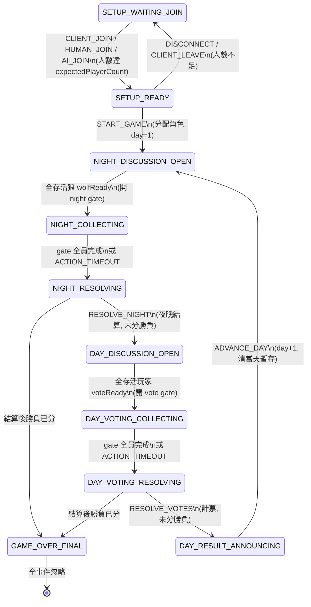

# 全遊戲狀態機流程

> 真相來源：`src/types.ts`（Phase/GameEvent/Effect 正典）、`src/game-state.ts`（`transition()` 純函式）、`src/engine.ts`（effect 執行）、`src/night.ts`（夜晚結算）、`src/day.ts`（勝負判定）。本文件為上述程式碼的導覽，衝突時以程式碼為準。

## 1. 架構總覽

```
事件（GameEvent，27 種）
  → GameEngine.enqueue() ──→ drain() 同步迴圈
      → transition(state, event)   ← 純函式、原地 mutate、回傳 TransitionResult
          ├─ state 變更（phase / players / logs / counters）
          └─ effects: Effect[]      ← I/O 副作用只描述、不執行
      → engine 逐個執行 effects：
          BROADCAST（快照廣播）/ SAVE（debounce 存檔）/ ARM_GATE（開 gate timer）
          / DISPATCH_LLM（派 AI 行動）/ ENQUEUE（級聯內部事件）/ IDLE_TAKEOVER（掛機接管）
```

- **純函式邊界**：`transition()` 不碰 timer/LLM/網路/檔案，一切副作用以 Effect 回傳由 engine 執行；這讓狀態機可單測（`game-state.test.ts`）。
- **級聯推進**：gate 完成 → `ENQUEUE RESOLVE_NIGHT / RESOLVE_VOTES` → 同一次 drain 內繼續處理；engine 的 `AUTO_ADVANCE_PHASES = ['NIGHT_RESOLVING', 'DAY_VOTING_RESOLVING', 'DAY_RESULT_ANNOUNCING']` 進入時自動補 ENQUEUE 對應內部事件（讀檔恢復的安全網）。
- **phase 變更**：engine 立即 `save()`（flushSave）＋ `onPhaseEntered()`（gate timer / LLM 分派 / scheduler 通知）；其餘 SAVE effect 走 debounce（預設 5s）。

## 2. Phase 狀態圖（10 值）



## 3. 各 Phase 詳解

### SETUP_WAITING_JOIN（等待加入）
| 事件 | 行為 |
|------|------|
| `CLIENT_JOIN` | push 玩家（`makeLobbyPlayer`，依 `humanPlayerIndices` 決定 human/ai）；滿員 → SETUP_READY |
| `HUMAN_JOIN` / `AI_JOIN` | 選座加入（`applySeatJoin`）：真人選座會先把前方空位 1..id-1 補成 AI；座位被真人佔 → 拒絕；被 AI 佔 → 真人轉換（HUMAN_JOIN） |
| `DISCONNECT` | 該座位玩家移除 |
| `CLIENT_LEAVE` | pop 最後一位 |
| `START_GAME` | **拒絕**（not enough players） |

### SETUP_READY（滿員待開）
| 事件 | 行為 |
|------|------|
| `START_GAME` | `assignRolesToPlayers`（ROLE_CONFIG 洗牌配角、共有者配對 masonPartnerId）→ day=1 → 清空 voteReady/wolfReady/wolfDiscussionLog/skippedHumans/idleCounts/takenOver/nightActions → **NIGHT_DISCUSSION_OPEN**，boardVersion++ |
| `DISCONNECT` / `CLIENT_LEAVE` | 人數不足 → 回 SETUP_WAITING_JOIN |
| `CLIENT_JOIN` / `HUMAN_JOIN` / `AI_JOIN` | 滿員後仍可加入？`CLIENT_JOIN` 會因 lobby full 拒絕；座位事件照 `applySeatJoin` 處理（轉換 AI 座位為真人） |

### NIGHT_DISCUSSION_OPEN（狼密談，僅狼可見）
| 事件 | 行為 |
|------|------|
| `HUMAN_WOLF_SPEAK` / `AI_WOLF_SPEECH_DONE` | 寫入 `wolfDiscussionLog`（僅存活狼可寫；AI 版本需夾帶相符 boardVersion，不符丟棄），boardVersion++；AI 狼發話時對未就緒真人狼累計 idleCounts |
| `HUMAN_WOLF_READY` / `AI_WOLF_READY` | 加入 `wolfReady`（單向）；**全存活狼 ready → NIGHT_COLLECTING 並開 night gate** |
| `HUMAN_WOLF_UNREADY` | 移出 wolfReady（真人可收回）；清空掛機計數 |
| `DISCONNECT` / `RECONNECT` | 見 §8 |

### NIGHT_COLLECTING（收集夜晚行動）
- gate `required = getNightActors(state)`：**占卜師（存活）＋ 獵人（存活且 day > 1）＋ 全部存活狼**；開 gate 時對 AI 座位逐個 `DISPATCH_LLM kind:'night'`（真人自行行動）。
| 事件 | 行為 |
|------|------|
| `HUMAN_NIGHT_ACTION` / `AI_NIGHT_DONE` | `recordNightAction`：驗證 actor 存活、角色有夜晚行動、目標存活且非自己；覆寫該 actor 先前行動；`markGateDone`。**gate 全員完成 → NIGHT_RESOLVING + ENQUEUE RESOLVE_NIGHT** |
| `ACTION_TIMEOUT` | gate 消費 → NIGHT_RESOLVING + ENQUEUE RESOLVE_NIGHT（未行動者由結算層隨機補） |

### NIGHT_RESOLVING（夜晚結算）
| 事件 | 行為 |
|------|------|
| `RESOLVE_NIGHT`（內部） | 呼叫 `night.ts resolveNightActions`（見 §4）；把 seer/guard 結果寫入 state 層 `seerChecks`/`guardProtects`；boardVersion++；`applyWinCheck`：未分勝負 → **DAY_DISCUSSION_OPEN**；分勝負 → GAME_OVER_FINAL |

### DAY_DISCUSSION_OPEN（白天討論）
| 事件 | 行為 |
|------|------|
| `HUMAN_SPEAK` | 寫 `discussionLog`（`stripSpeechPrefix` 剝 Px：前綴），boardVersion++；清掛機計數 |
| `AI_SPEECH_DONE` | 同上（需相符 boardVersion）；對未 ready 真人累計 idleCounts，達閾值 → IDLE_TAKEOVER effect |
| `HUMAN_SKIP` | 記入 skippedHumans（保留語義，scheduler 已不依賴）；清掛機計數 |
| `HUMAN_READY_VOTE` / `AI_READY_VOTE` | 加入 `voteReady`（AI 單向不退）；**全存活玩家 ready → DAY_VOTING_COLLECTING 並開 vote gate** |
| `HUMAN_UNREADY_VOTE` | 真人收回 ready；清掛機計數 |
| `MASON_CHAT` | 僅存活共有者可寫 `masonChatLog`（全天可寫，不限夜晚） |
| `DISCONNECT` / `RECONNECT` | 見 §8 |

### DAY_VOTING_COLLECTING（收集投票）
- gate `required = 全部存活玩家`；AI 座位 `DISPATCH_LLM kind:'vote'`。
| 事件 | 行為 |
|------|------|
| `HUMAN_VOTE` / `AI_VOTE_DONE` | `recordVote`：驗證雙方存活；同日同投票人舊票覆寫；`markGateDone`。**gate 完成 → DAY_VOTING_RESOLVING + ENQUEUE RESOLVE_VOTES** |
| `ACTION_TIMEOUT` | 同上強制進結算 |

### DAY_VOTING_RESOLVING（計票）
| 事件 | 行為 |
|------|------|
| `RESOLVE_VOTES`（內部） | 統計當日票數：最高票且**非平票** → 該玩家出局（`alive=false`、deathHistory 記 `cause:'vote'`）；**平票 = 無人出局（全系統唯一規則）**；boardVersion++；`applyWinCheck`：未分勝負 → DAY_RESULT_ANNOUNCING；分勝負 → GAME_OVER_FINAL |

### DAY_RESULT_ANNOUNCING（公布結果）
| 事件 | 行為 |
|------|------|
| `ADVANCE_DAY`（內部） | `daySummaries.push(summarizeDay)`；day++；清空 nightActions/voteReady/wolfReady/skippedHumans/idleCounts；刪除 night 相容暫存（wolfKillTarget/guardProtectedTarget/seerCheckTarget/seerCheckResult）；**`wolfDiscussionLog` 跨日保留（不再清空），prompt 層以 `=== 第N天 ===` 分隔線呈現**；boardVersion++ → **NIGHT_DISCUSSION_OPEN**（新一天） |

### GAME_OVER_FINAL
- 一切事件忽略（`transition` 開頭短路）。engine 偵測 `gameOver` 由 false 翻 true 時觸發 `onGameOver`（server 據此安排 10 秒後回大廳、保留座位）。

## 4. 夜晚結算規則（night.ts `resolveNightActions`，唯一來源）

結算順序：**守衛 → 狼殺 → 占卜**（守衛先於狼殺，同一夜可擋刀）。

1. **守衛**：day 1 不可行動（`canGuardAct` 要求 day > 1）；指定自己 → 無效，改隨機守護他人；無行動 → 隨機守護（非自己）。
2. **狼殺**：多數決 — 同目標票數最高者勝；**平手 → 先提交者勝**（nightActions 依提交順序）。目標鐵則：必須**非人狼且存活**（同盟/自己目標一律視為無效過濾）；全部無效或無行動 → 隨機非狼目標。守衛擋刀 → 平安夜（`killBlocked`，guardProtects 記 success）。
3. **占卜**：無行動 → 隨機查驗（非自己）。結果 `seerSeesAs`：狼 → 人狼，其餘（含狂人、共有者）→ 村人。
4. **靈能者**：不在夜間結算內 — 黎明由 `getMediumInfoAtDawn` / `getMediumResults`（deathHistory 推導）取得**昨日票死者**身分；夜死者身分不揭露。

## 5. 勝利條件（day.ts `checkWinCondition`）

- **人狼勝**：存活狼數 ≥ 存活村人陣營數（且狼 > 0）
- **村人勝**：存活狼 = 0
- 檢查時機：NIGHT_RESOLVING 與 DAY_VOTING_RESOLVING 結算後（`applyWinCheck`）。狂人 team=village 但隨狼勝（ROLE_TEAM 註記）。

## 6. Gate 與 timeout

- `PendingGate { kind:'night'|'vote', required[], done[], timeoutMs, deadline }`；transition 開 gate 時 deadline=0，engine `armGate` 補上 timer。
- timeout 由 mode 決定：**gm 模式 = Infinity（無 timer，靠 CLI 推進）**；web 模式 night 90s、vote 60s（`EngineOptions.nightTimeoutMs/voteTimeoutMs` 可覆寫）。
- timeout 觸發 → `ACTION_TIMEOUT` 事件 → transition 消費 gate、強制進結算（未行動者由結算層隨機補齊）。
- gate 被 transition 消費（pendingGate=null）時，engine 清殘留 timer；過期 timer 觸發也會被 phase 檢查自然丟棄。

## 7. boardVersion（白板版本）

- 每次討論/密談寫入、結算、phase 推進都會 `boardVersion++`。
- `AI_SPEECH_DONE` / `AI_WOLF_SPEECH_DONE` 產生時**捕獲當下 boardVersion**，transition 比對不符 → 丟棄（stale，避免 AI 舊草稿覆蓋新白板）。
- engine：boardVersion 變更且 phase 未變 → `scheduler.onBoardUpdated()`（SpeechScheduler 據此重啟生產線/CD）；phase 變更 → `onPhaseEntered()` 統一處理，避免 scheduler 以舊 mode 誤啟動。

## 8. 真人生命週期（斷線 / 重連 / 掛機接管）

| 機制 | 行為 |
|------|------|
| `DISCONNECT` | 座位翻 `controlledBy:'ai'`；移出 voteReady/wolfReady/skippedHumans；若在 gate 內未完成 → 補 `DISPATCH_LLM`（AI 代行）。冪等（已是 ai 則接受不變） |
| `RECONNECT` | 僅存活玩家、僅遊戲中（SETUP 拒絕）；翻回 human；移出 voteReady/wolfReady（回到未定）；清 idleCounts；移出 takenOver |
| 掛機接管 | `IDLE_TAKEOVER_THRESHOLD = 10`：AI 發話時，未 ready 真人各 +1（記 `idleCounts`）；真人發話/跳過/收回/ready 即清空。達閾值 → `IDLE_TAKEOVER` effect → `applyIdleTakeover`（翻 ai、記 `takenOver`、gate 補派 LLM、通知本人）；重連可拿回 |
| AI 行動重試 | `dispatchLLM` 失敗/被拒重試 1 次；重試前檢查座位仍為 ai（被真人拿回則放棄）；兩次皆失敗 → 放棄該行動，gate 由他人或 timeout 推進 |

## 9. 存檔（game-state.json）

- 位置：`getDataDir()/game-state.json`（dev = repo root；pkg = exe 旁 `data/`）。
- 原子寫入：`.tmp` → rename；載入檢查 `schemaVersion`（不符視為無檔）。
- 時機：phase 變更 → 立即 flushSave；其餘 SAVE effect → debounce 5s（`saveDebounceMs` 可調）。

## 10. 事件總表（27 種，types.ts）

| 類別 | 事件 |
|------|------|
| 大廳 | `CLIENT_JOIN` `CLIENT_LEAVE` `START_GAME` `HUMAN_JOIN` `AI_JOIN` |
| 白天討論 | `HUMAN_SPEAK` `HUMAN_SKIP` `HUMAN_READY_VOTE` `HUMAN_UNREADY_VOTE` `AI_SPEECH_DONE` `AI_READY_VOTE` `MASON_CHAT` |
| 狼密談 | `HUMAN_WOLF_SPEAK` `AI_WOLF_SPEECH_DONE` `HUMAN_WOLF_READY` `AI_WOLF_READY` `HUMAN_WOLF_UNREADY` |
| 夜晚 | `HUMAN_NIGHT_ACTION` `AI_NIGHT_DONE` |
| 投票 | `HUMAN_VOTE` `AI_VOTE_DONE` |
| 連線 | `DISCONNECT` `RECONNECT` |
| 內部（engine 自派） | `ACTION_TIMEOUT` `RESOLVE_NIGHT` `RESOLVE_VOTES` `ADVANCE_DAY` |

## 11. 快照視角（隱私邊界）

| 建構式 | 對象 | 內容 |
|--------|------|------|
| `buildLobbySnapshot` | SETUP 階段全員 | 座位/人數/觀戰名單（唯一允許 controlledBy 的介面） |
| `buildPlayerSnapshot` | 各玩家 | 公開欄位 + `you`（僅自身角色/私有情報：seerChecks、guardProtects、mediumResults、masonChatLog、wolfAllyIds、wolfDiscussionLog、wolfMeeting）；**永不洩漏他人 role/team/controlledBy** |
| `buildSpectatorSnapshot` | 觀戰者 | 僅公開欄位，無 `you` |
| `buildGMSnapshot` | GM | 全貌（roles、nightActions、wolfDiscussionLog、idleCounts、flagStats） |

修改任何快照時，維持「角色/夜間資訊不洩漏到玩家或觀戰視圖」的鐵則（見 AGENTS.md）。
